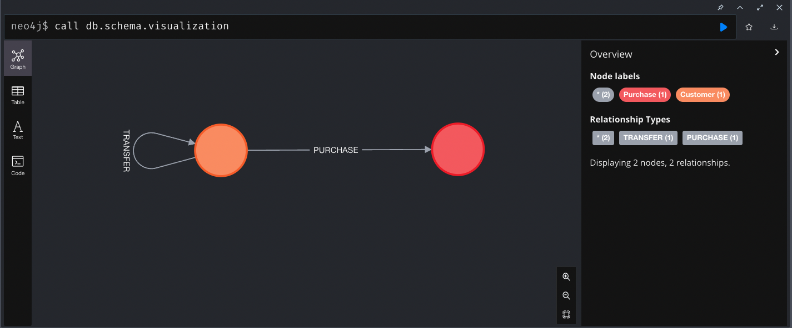
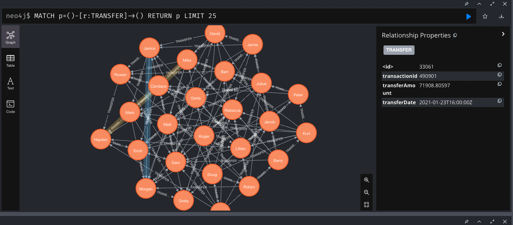
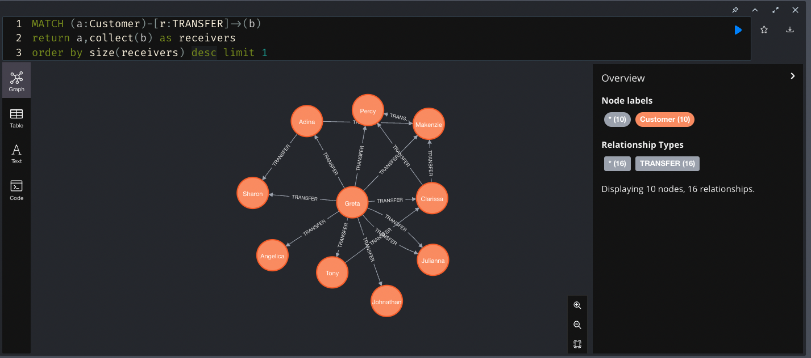
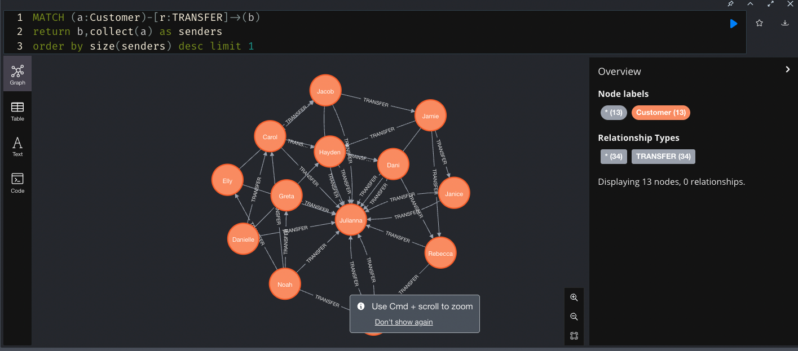

## Using Spring Boot/Spring Batch/Spring Data Neo4j to convert CSVs into Nodes and Edges in Neo4j.


### Set up Neo4j (Docker / VM). 

```
docker run --publish=7474:7474 --publish=7687:7687 --volume=$HOME/neo4j/data:/data -e dbms.memory.heap.initial_size=1024m -e dbms.memory.heap.max_size=2048m  neo4j
```

### Data Access

Orignal Data: [Banking - Customer & Transaction Data](https://gist.github.com/maruthiprithivi/f11bf40b558879aca0c30ce76e7dec98)

Please note, if you wish to follow the exercise, please use the data in this repo as is (src/main/resource/data). Some minor modifications were done on the original data due to duplicate primary keys. 

### Data Model



### Configuration (.properties file)

Change the uri, username and password for your own docker environment.
```
spring.neo4j.uri=bolt://localhost:7687
spring.neo4j.authentication.username=neo4j
spring.neo4j.authentication.password=*************

spring.mvc.format.date-time=yyyy-MM-dd HH:mm:ss

customerFile=data/customers.csv
transferFile=data/transfers.csv
purchaseFile=data/purchases.csv
```

### Compile and package

```
mvn clean package
```

### Run the application

#### Step 1. Ingest the CSVs

In step 1, we are simply ingesting the tables(CSVs) as nodes in neo4j. 

```
java -jar -Dspring.profiles.active=ingest target/neo4j-interview-exercise-0.0.1.jar
```

#### Step 2. Build Relationship(Edge)

In step 2, we are building the graph edges(relationships) by re-iterating through the Customer,Transfer and Purchase nodes. Although, programatically, this is achievable through interacting with Neo4jRepository interface, the write performance is extremely low this way, even for our sample dataset. Hence we are creating a custom ItemReader and utilizing the power of Spring Batch. The job was done in about 3 minutes! 

```
java -jar -Dspring.profiles.active=build target/neo4j-interview-exercise-0.0.1.jar


  .   ____          _            __ _ _
 /\\ / ___'_ __ _ _(_)_ __  __ _ \ \ \ \
( ( )\___ | '_ | '_| | '_ \/ _` | \ \ \ \
 \\/  ___)| |_)| | | | | || (_| |  ) ) ) )
  '  |____| .__|_| |_|_| |_\__, | / / / /
 =========|_|==============|___/=/_/_/_/
 :: Spring Boot ::                (v2.6.3)

2022-05-30 10:58:14.468  INFO 57197 --- [           main] com.neo4j.demo.Application               : Starting Application using Java 11.0.15 on Franks-Mac-mini.local with PID 57197 (/Users/zhongjiezhang/dev/projects/neo4j_exercise/target/classes started by zhongjiezhang in /Users/zhongjiezhang/dev/projects/neo4j_exercise)
2022-05-30 10:58:14.468  INFO 57197 --- [           main] com.neo4j.demo.Application               : The following profiles are active: build
2022-05-30 10:58:14.587  INFO 57197 --- [           main] .s.d.r.c.RepositoryConfigurationDelegate : Bootstrapping Spring Data Neo4j repositories in DEFAULT mode.
2022-05-30 10:58:14.604  INFO 57197 --- [           main] .s.d.r.c.RepositoryConfigurationDelegate : Finished Spring Data repository scanning in 15 ms. Found 3 Neo4j repository interfaces.
2022-05-30 10:58:14.742  INFO 57197 --- [           main] org.neo4j.driver.internal.DriverFactory  : Direct driver instance 532297836 created for server address localhost:7687
2022-05-30 10:58:14.850  INFO 57197 --- [           main] com.neo4j.demo.service.GraphService      : Adding Purchases to Customers
2022-05-30 10:58:14.854  WARN 57197 --- [           main] o.s.b.c.c.a.DefaultBatchConfigurer       : No datasource was provided...using a Map based JobRepository
2022-05-30 10:58:14.854  WARN 57197 --- [           main] o.s.b.c.c.a.DefaultBatchConfigurer       : No transaction manager was provided, using a ResourcelessTransactionManager
2022-05-30 10:58:14.857  INFO 57197 --- [           main] o.s.b.c.l.support.SimpleJobLauncher      : No TaskExecutor has been set, defaulting to synchronous executor.
2022-05-30 10:58:15.688  INFO 57197 --- [           main] com.neo4j.demo.service.GraphService      : Adding Transfers to Customers
2022-05-30 10:58:15.758  WARN 57197 --- [           main] o.s.b.c.c.a.DefaultBatchConfigurer       : No datasource was provided...using a Map based JobRepository
2022-05-30 10:58:15.758  WARN 57197 --- [           main] o.s.b.c.c.a.DefaultBatchConfigurer       : No transaction manager was provided, using a ResourcelessTransactionManager
2022-05-30 10:58:15.759  INFO 57197 --- [           main] o.s.b.c.l.support.SimpleJobLauncher      : No TaskExecutor has been set, defaulting to synchronous executor.
2022-05-30 10:58:15.806  INFO 57197 --- [           main] com.neo4j.demo.Application               : Started Application in 1.46 seconds (JVM running for 1.838)
2022-05-30 10:58:15.807  INFO 57197 --- [           main] o.s.b.a.b.JobLauncherApplicationRunner   : Running default command line with: []
2022-05-30 10:58:15.817  INFO 57197 --- [           main] o.s.b.c.l.support.SimpleJobLauncher      : Job: [SimpleJob: [name=Build Graph]] launched with the following parameters: [{run.id=1}]
2022-05-30 10:58:15.828  INFO 57197 --- [           main] o.s.batch.core.job.SimpleStepHandler     : Executing step: [Add Purchase Step]
2022-05-30 10:58:15.835  WARN 57197 --- [           main] o.s.d.n.c.m.DefaultNeo4jIsNewStrategy    : Instances of class com.neo4j.demo.model.Customer with an assigned id will always be treated as new without version property!
2022-05-30 10:58:15.866  WARN 57197 --- [           main] o.s.d.n.c.m.DefaultNeo4jIsNewStrategy    : Instances of class com.neo4j.demo.model.Purchase with an assigned id will always be treated as new without version property!
2022-05-30 10:59:13.904  INFO 57197 --- [           main] o.s.batch.core.step.AbstractStep         : Step: [Add Purchase Step] executed in 58s76ms
2022-05-30 10:59:13.910  INFO 57197 --- [           main] o.s.batch.core.job.SimpleStepHandler     : Executing step: [Add Transfer Step]
2022-05-30 11:01:34.033  INFO 57197 --- [           main] o.s.batch.core.step.AbstractStep         : Step: [Add Transfer Step] executed in 2m20s122ms
2022-05-30 11:01:34.035  INFO 57197 --- [           main] o.s.b.c.l.support.SimpleJobLauncher      : Job: [SimpleJob: [name=Build Graph]] completed with the following parameters: [{run.id=1}] and the following status: [COMPLETED] in 3m18s211ms
2022-05-30 11:01:34.037  INFO 57197 --- [ionShutdownHook] o.neo4j.driver.internal.InternalDriver   : Closing driver instance 532297836
2022-05-30 11:01:34.039  INFO 57197 --- [ionShutdownHook] o.n.d.i.async.pool.ConnectionPoolImpl    : Closing connection pool towards localhost:7687

Process finished with exit code 0

```

Throughout the exercise, we've managed to create the nodes and edges using entirely Spring Boot + Spring Batch + Spring Data Neo4j + POJOs without a single line of cypher. 

### Query the graph 

Open browser at http://localhost:7474/browser/

#### Viewing the transfers (edges)



#### Getting the Sender with the most transfers



#### Getting the Receiver with the most transfers


